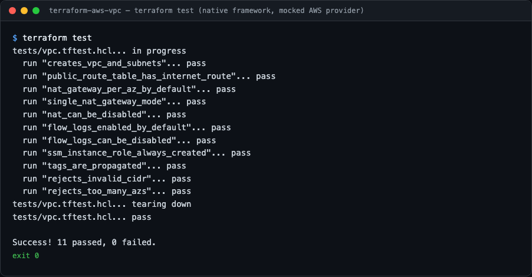
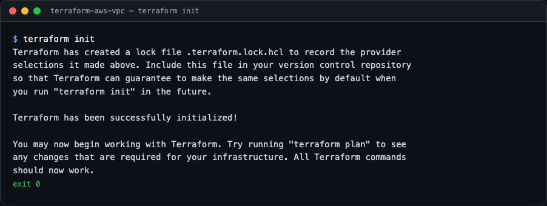
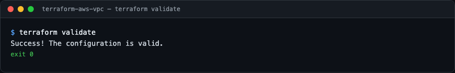
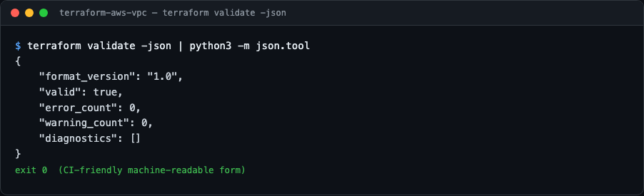

# terraform-aws-vpc

A production-style Terraform module that builds an AWS VPC with public and
private subnets across multiple availability zones, NAT gateway egress,
VPC flow logs, and least-privilege IAM roles.

The module is self-contained, fully tested with Terraform's native test
framework (no AWS credentials required), and ready to drop into a real
infrastructure stack.

## Preview

Real output from the module's own commands (no AWS account needed — the
test suite runs against Terraform's mocked provider):



<details>
<summary>More views</summary>







</details>

## What it creates

- **VPC** with DNS support/hostnames enabled
- **Public subnets** (one per AZ) with a shared route table routing
  `0.0.0.0/0` to an **internet gateway**
- **Private subnets** (one per AZ), each with its own route table
- **NAT gateways** in the public subnets — one per AZ for high availability,
  or a single shared one for cost savings (`single_nat_gateway = true`)
- **VPC flow logs** delivered to CloudWatch Logs, with a dedicated IAM role
- **SSM instance profile** so EC2 hosts in private subnets are reachable via
  AWS Systems Manager Session Manager — no SSH keys, no bastion, no public IPs

## Architecture

```
                        ┌─────────────────────────── VPC ───────────────────────────┐
                        │                                                            │
   Internet ──► Internet Gateway                                                     │
                        │        │                                                   │
        ┌───────────────┼────────┼───────────────────────────────┐                   │
        │ Public subnets│        │ (per AZ)                      │                   │
        │  10.0.1.0/24  │  10.0.2.0/24   10.0.3.0/24            │                   │
        │      └── NAT GW (per AZ, or 1 shared)                 │                   │
        └───────────────┼────────┬───────────────────────────────┘                   │
                        │        │ 0.0.0.0/0 via NAT                                 │
        ┌───────────────┼────────┼───────────────────────────────┐                   │
        │ Private subnets        │ (per AZ, per-AZ route tables) │                   │
        │  10.0.101.0/24  10.0.102.0/24  10.0.103.0/24           │                   │
        │  EC2 + SSM instance profile (no public IPs)            │                   │
        └────────────────────────────────────────────────────────┘                   │
                        │                                                            │
        VPC flow logs ──► CloudWatch Logs (IAM role, least privilege)                │
                        └────────────────────────────────────────────────────────────┘
```

## Design decisions

- **Per-AZ private route tables.** Each private subnet egresses through the NAT
  gateway in its own AZ. If one NAT gateway fails, only that AZ loses internet
  egress instead of the whole VPC.
- **NAT in every AZ by default.** AWS charges per NAT gateway (~$32/month plus
  data), so `single_nat_gateway = true` trades AZ redundancy for cost in
  dev/test environments. `enable_nat_gateway = false` skips NAT entirely for
  workloads that only need VPC-internal connectivity.
- **Flow logs with a dedicated role.** The flow-logs role trusts only
  `vpc-flow-logs.amazonaws.com` and gets an inline policy scoped to CloudWatch
  Logs actions — no managed `*` policies.
- **SSM instead of SSH.** Private instances use the
  `AmazonSSMManagedInstanceCore` managed policy via an instance profile, giving
  shell access through Session Manager with CloudTrail auditing and no exposed
  port 22.
- **Fail fast on bad input.** Variable validation rejects malformed CIDRs,
  empty names, and unrealistic AZ counts at plan time.
- **Tagging is uniform.** Every resource gets `Project` and `ManagedBy` tags
  merged with caller-supplied tags, so cost allocation and ownership queries
  work out of the box.

## Tech stack

- Terraform `>= 1.6` (tests require `>= 1.7` for provider mocking)
- AWS provider `>= 5.0, < 6.0`
- Native `terraform test` (`.tftest.hcl`) with a mocked AWS provider

## Usage

```hcl
module "vpc" {
  source = "github.com/your-org/terraform-aws-vpc"  # or a local path

  name       = "prod"
  cidr_block = "10.20.0.0/16"

  azs             = ["us-east-1a", "us-east-1b", "us-east-1c"]
  public_subnets  = ["10.20.1.0/24", "10.20.2.0/24", "10.20.3.0/24"]
  private_subnets = ["10.20.101.0/24", "10.20.102.0/24", "10.20.103.0/24"]

  single_nat_gateway = false  # one NAT per AZ (HA)

  tags = {
    Environment = "prod"
    Team        = "platform"
  }
}
```

A complete working example lives in [`examples/complete`](examples/complete/main.tf).

### Inputs

| Name | Type | Default | Description |
| --- | --- | --- | --- |
| `name` | `string` | — | Name prefix for all resources (required) |
| `cidr_block` | `string` | `"10.0.0.0/16"` | VPC IPv4 CIDR |
| `azs` | `list(string)` | — | Availability zones (required) |
| `public_subnets` | `list(string)` | — | Public subnet CIDRs, one per AZ (required) |
| `private_subnets` | `list(string)` | — | Private subnet CIDRs, one per AZ (required) |
| `enable_nat_gateway` | `bool` | `true` | Create NAT gateways for private egress |
| `single_nat_gateway` | `bool` | `false` | Share one NAT across all AZs (cheaper) |
| `enable_dns_hostnames` | `bool` | `true` | VPC DNS hostnames |
| `enable_dns_support` | `bool` | `true` | VPC DNS resolution |
| `enable_flow_logs` | `bool` | `true` | Publish flow logs to CloudWatch |
| `flow_logs_retention_days` | `number` | `30` | CloudWatch retention for flow logs |
| `tags` | `map(string)` | `{}` | Extra tags on every resource |

### Outputs

| Name | Description |
| --- | --- |
| `vpc_id` / `vpc_cidr_block` | VPC ID and CIDR |
| `public_subnet_ids` / `private_subnet_ids` | Subnet IDs in AZ order |
| `public_route_table_id` / `private_route_table_ids` | Route table IDs |
| `nat_gateway_ids` / `nat_public_ips` | NAT gateway IDs and Elastic IPs |
| `flow_logs_role_arn` | IAM role ARN for flow logs |
| `ssm_instance_profile_name` | Instance profile for SSM-managed hosts |

## Development

```bash
terraform init -backend=false   # downloads the AWS provider
terraform fmt -recursive        # format
terraform validate              # static validation
terraform test                  # run the test suite (mocked, no credentials)
```

The test suite in [`tests/vpc.tftest.hcl`](tests/vpc.tftest.hcl) runs 11 plan
scenarios against a mocked AWS provider: subnet topology, NAT gateway modes,
route tables, flow logs, IAM roles, tag propagation, and input validation.

## License

MIT — see [LICENSE](LICENSE).
